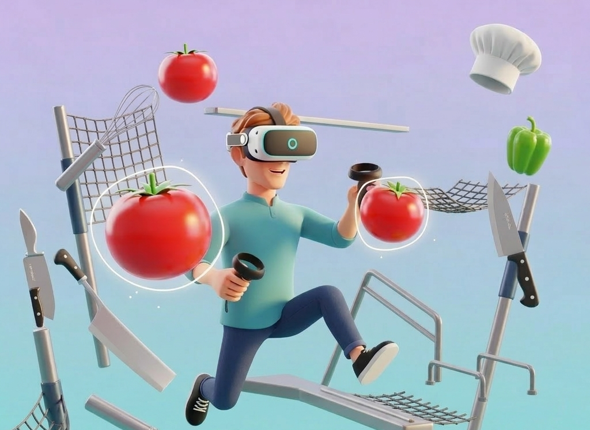

This project presents a Virtual Reality (VR) parkour experience inspired by the control metaphor introduced in the animated film Ratatouille. In the film, the character Remy indirectly controls the human character Linguini by manipulating his movements from above. Translating this idea into an interactive VR context, the project explores how indirect control mechanisms can be used to create a unique locomotion and interaction system.

The game places the player in a virtual environment where they control a humanoid avatar through VR controllers rather than embodying the character directly. Two cylindrical control objects are mounted on the avatar’s head, and the player uses these objects to guide the avatar through a parkour-style environment. This design creates a puppet-like control scheme in which the player remains physically separate from the avatar while influencing its movement and actions.

The gameplay focuses on environmental navigation and object-based interaction. Instead of traditional collectible items such as coins, the environment features thematic elements inspired by culinary motifs, such as vegetables. These objects serve both as rewards and as immersive elements that reinforce the thematic context of the game.

A central gameplay mechanic involves a tool-based interaction system. Rather than directly manipulating objects, players interact with a key through an intermediary tool—a knife. The knife functions as a manipulation instrument that allows the player to approach, guide, and align the key with a target object, such as a treasure chest. This indirect interaction mechanism emphasizes precision and intentionality in player actions.

To support usability and improve interaction stability in VR, the system incorporates several assistance mechanisms. For example, snapping behavior is implemented when the knife approaches the key, helping the player align the objects correctly and reducing motor instability during precise manipulation tasks. The interaction is further validated through positional and rotational constraints, ensuring that the correct alignment of objects triggers the next game state.

Successful completion of the interaction results in a visible transformation of the environment. When the key is correctly positioned using the knife, the treasure chest disappears and a new object—a book—appears in its place. This transition is accompanied by sound and particle effects that provide immediate feedback and reinforce the sense of achievement.

The project also explores the design challenges involved in creating comfortable and responsive VR experiences. Key considerations include maintaining synchronization between camera and avatar motion, managing the lifecycle of interactive objects, and balancing responsiveness with user comfort to minimize motion sickness. These challenges highlight the complexity of designing interaction systems that remain both intuitive and stable within immersive environments.

Overall, the project investigates how metaphor-driven interaction design and tool-based manipulation systems can enrich VR gameplay. By combining parkour-style navigation with indirect object control, the project demonstrates how unconventional interaction models can contribute to more engaging and immersive virtual experiences.

