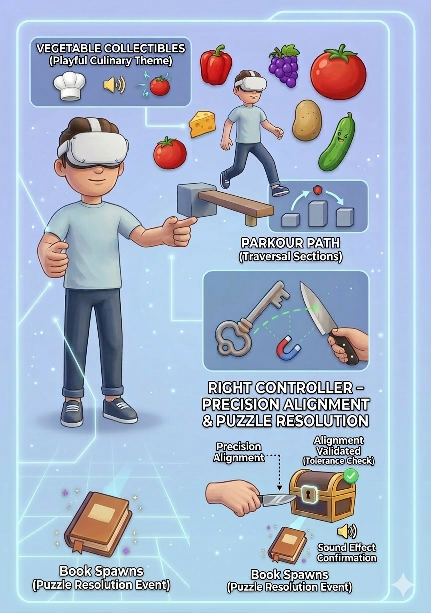
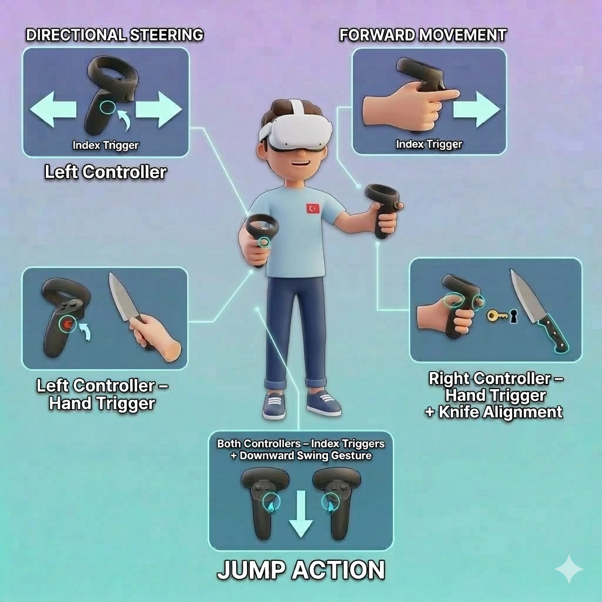

The gameplay combines gesture-based locomotion, environmental exploration, and tool-mediated object interaction within a stylized VR parkour environment. The experience is designed not only around traversal, but also around how players physically interact with objects and systems in the virtual space.

Movement in the game is implemented through a gesture-supported locomotion system using Meta Quest controllers. Instead of relying on traditional joystick navigation, the system maps controller gestures and trigger inputs to character movement. This approach allows the player’s physical motions to directly influence navigation within the environment.

Forward movement is triggered when the player presses the right controller index trigger while extending the controller forward, allowing the avatar to move in the direction of the gesture. Directional steering is controlled through the left controller index trigger combined with lateral controller tilt, enabling the player to steer left or right while moving. Jumping is performed through a downward swinging gesture while pressing both index triggers, turning jumping into a physical motion rather than a simple button press.

This locomotion design transforms navigation into a more embodied interaction model, where player gestures become part of the gameplay experience.

As the player progresses through the environment, collectible objects appear along the parkour path. Instead of traditional coins, the game features vegetable-themed collectibles that match the playful culinary theme of the environment. Collecting these objects provides feedback through sound effects, reinforcing player interaction and enhancing immersion.

A central part of the gameplay is the object interaction system, which is based on indirect manipulation rather than direct grabbing. The interaction sequence begins when the player grabs a knife using the left controller hand trigger. The knife acts as a tool that allows the player to interact with other objects in the environment.

When the knife approaches the key, the system detects spatial proximity and applies a snap-based attachment behavior. This snapping mechanism allows the key to attach to the knife once the player aligns it closely enough. The purpose of this system is to support precision interactions while reducing frustration caused by small tracking inaccuracies or motor instability.

Once attached to the knife, the key can be transported through the environment. The player must guide the key toward a chest and align it with the correct slot. To validate this interaction, the system evaluates both positional and rotational constraints between the key and the slot. The interaction is considered successful only when the key is aligned within predefined tolerance thresholds.

When the correct alignment is detected, the system triggers the puzzle resolution event. The chest object disappears and a book is spawned at a designated location. Audio feedback and particle effects accompany this transition, providing clear confirmation that the interaction has been completed successfully.

From a gameplay perspective, the experience alternates between dynamic parkour movement and slower interaction-focused moments. Traversal sections emphasize spatial navigation and gesture-based locomotion, while interaction sections require deliberate manipulation of objects and careful alignment. This balance introduces variation in pacing and encourages players to engage with the environment through multiple forms of interaction.

Overall, the gameplay design integrates gesture-based movement, tool-mediated interaction mechanics, and environmental feedback systems into a cohesive VR experience.

## User Input & Interaction Controls

The interaction system relies on specific controller gestures and trigger inputs mapped to gameplay actions:

### Left Controller – Index Trigger + Lateral Tilt
Directional steering (Left / Right)

### Right Controller – Index Trigger + Forward Extension
Forward movement

### Left Controller – Hand Trigger
Knife grab interaction

### Right Controller – Hand Trigger + Knife Alignment
Key manipulation using the knife

### Both Controllers – Index Triggers + Downward Swing Gesture
Jump action

