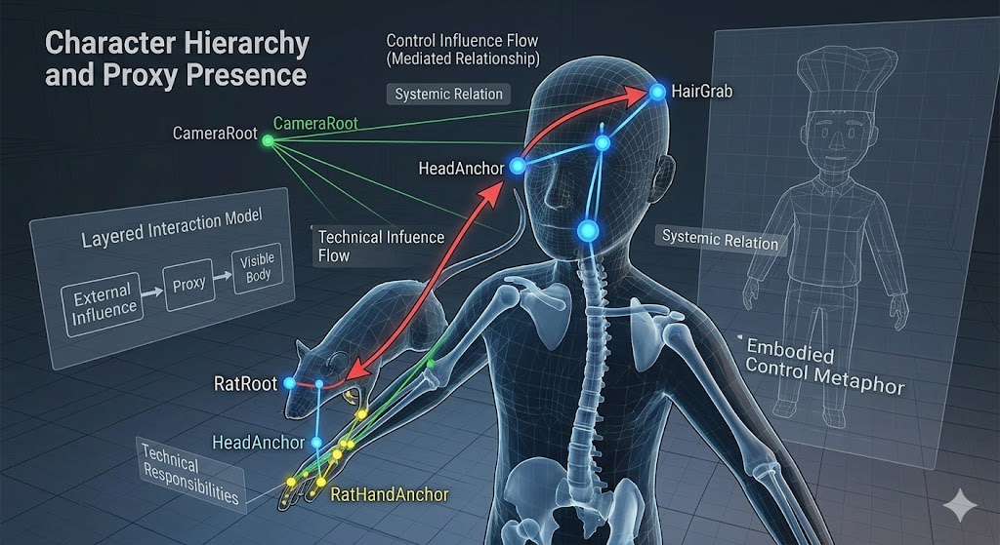

The first developmental axis of the project was to treat movement not as a purely mechanical
response to player input but as a design problem that defined who or what was actually being
controlled inside the scene. For that reason, the project did not begin by writing a simple avatar
controller. Instead, it first examined whether the visible human, the camera, and the controlling
influence should be interpreted as the same entity or as layered roles inside one mediated
interaction model.
At this stage a deliberate interpretation layer was placed between input and movement. High-level
meanings such as Move, Turn, Jump, and Action were not treated as raw transform changes but as
gameplay intentions that could later be translated by different systems. This allowed the project to
grow without locking itself into one device-specific movement script. Controller-driven pull
locomotion, proxy influence, and the rat-human relationship all became possible because the project
had already separated signal from action.
This definition of control changed the nature of the entire prototype. The player was no longer
framed as a floating observer who simply drives a camera through space. Instead, the player
became part of a relationship between a visible human body and an external source of influence.

That framing gave later visual, mechanical, and spatial decisions a common direction.
As a result, the core principle of the project became clear very early: reading input and applying
movement are not the same operation, and the interpretive layer between them defines the identity
of the experience. The first milestone therefore functioned not only as a conceptual starting point
but as the technical and experiential foundation of the whole project.

## General Overview of the Project

## Defining the Core Control Philosophy

The first developmental axis of the project was to treat movement not as a purely mechanical
response to player input but as a design problem that defined who or what was actually being
controlled inside the scene. For that reason, the project did not begin by writing a simple avatar
controller. Instead, it first examined whether the visible human, the camera, and the controlling
influence should be interpreted as the same entity or as layered roles inside one mediated
interaction model.
At this stage a deliberate interpretation layer was placed between input and movement. High-level
meanings such as Move, Turn, Jump, and Action were not treated as raw transform changes but as
gameplay intentions that could later be translated by different systems. This allowed the project to
grow without locking itself into one device-specific movement script. Controller-driven pull
locomotion, proxy influence, and the rat-human relationship all became possible because the project
had already separated signal from action.
This definition of control changed the nature of the entire prototype. The player was no longer
framed as a floating observer who simply drives a camera through space. Instead, the player
became part of a relationship between a visible human body and an external source of influence.

That framing gave later visual, mechanical, and spatial decisions a common direction.
As a result, the core principle of the project became clear very early: reading input and applying
movement are not the same operation, and the interpretive layer between them defines the identity
of the experience. The first milestone therefore functioned not only as a conceptual starting point
but as the technical and experiential foundation of the whole project.

## Prototyping and Refactoring the Locomotion Architecture

Once the control philosophy was defined, development moved toward turning that idea into a
workable locomotion architecture. Early movement prototypes focused on understanding how data
coming from different scripts should flow into scene movement. During this phase, intent-producing
layers, speed and direction interpretation layers, and the final movement-application layer began to
separate into recognizable roles. The main goal was not yet richer traversal, but a locomotion
structure that could be reasoned about and expanded safely.
Components such as ParkourIntentDriver, ProxyControllerInputOVR, and ControllerInputReader
emerged as different producers of movement-relevant information. Some generated high-level
intentions from player actions, while others extracted gesture-like or analog data from the
controllers themselves. At the end of that chain, a central role represented by
UnifiedLocomotionController resolved and applied final movement to the scene. This made it
possible to distinguish clearly between systems that supplied movement data and the one system
that actually owned final scene translation.
The refactor was more than a matter of code cleanliness. It clarified locomotion ownership so that
later expansions would remain stable. Speed, boost, steering, and jump-like behavior could now
coexist on one physical movement root while still being sourced from distinct logic paths. This made
it easier to add new behaviors without destabilizing the rest of the structure.
By the end of the milestone, locomotion had become an extensible backbone rather than a cluster of
competing movement scripts. That backbone later supported controller-pull logic, camera design,
and indirect object interaction without requiring the project to reinvent its movement foundation
each time.

## Building the Character Hierarchy and Proxy Presence

As the locomotion layer became more coherent, the project addressed the question of what the
player was actually controlling through the scene hierarchy itself. The visible human body and the
influencing source of control were organized through references such as RatRoot, CameraRoot,
HairGrab, HeadAnchor, and RatHandAnchor. These did not function as arbitrary scene nodes; they
defined the spatial and systemic relation between the body that was seen and the force that acted
upon it.
The purpose of this hierarchy was not merely to parent objects neatly. Each reference point clarified
a role inside the project: which root owned motion, which anchor served visual communication, and
which point defined camera and perception. The character setup therefore became a technical
arrangement of responsibilities rather than a simple model placement task.
On the experiential side, the milestone strengthened proxy presence. The player was no longer
meant to feel like an abstract floating viewpoint. Through the visible human form, implied shoulder
silhouette, and the staged relation to the rat, the scene began to communicate that the player was
participating in a layered body relationship. This made the control metaphor more embodied.
By the end of the milestone, the project had achieved two linked outcomes: its scene hierarchy was
technically more coherent, and the feeling produced by that technical arrangement became more legible to the player. 
This directly prepared the ground for making the rat-human identity more convincing in the following stages.

## Establishing Rat Believability and Gameplay Identity

At this stage the project acquired a stronger thematic and visual identity. The rat was no longer left
as a symbolic suggestion of control; it became an active and readable part of the experience. Its
presence in the scene, its relation to the human character, and its role in communicating indirect
control all became more explicit.
On the believability side, the focus shifted toward scene presence, perceived liveliness, and
micro-motions that made the rat feel like a real participant in the world. Secondary motion layers,
breathing-like subtle movement, and better integration with scale and placement helped transform
the rat from a metaphorical placeholder into a creature that appeared to inhabit the environment.
That change made the control relationship feel less theoretical and more immediate.
At the same time, the gameplay identity of the project was refined through the collectible layer.
Rather than relying on generic coins, the environment began using ingredient- or vegetable-based
objects as rewards. This strengthened the tone of the world and gave traversal moments a more
consistent thematic language. Reward and movement became part of the same representational
style.
As a result, the project became more than an unusual locomotion prototype. It gained a distinct
atmosphere, a recognizable visual language, and a stronger sense of world. The rat's believability
and the game's identity matured together, making later interaction systems feel more natural within
the overall experience.

## Designing Controller-Based Pull Locomotion

The next major locomotion step was to move beyond a conventional thumbstick-centered model and
toward a movement language driven more directly by bodily controller motion. The project therefore
adopted a pull-and-steer concept in which hand movement and trigger input jointly shaped
traversal. This made the controllers active motion instruments rather than mere selectors.
Systems such as ControllerInputReader captured an initial local reference pose and then measured
frame-by-frame deltas against that baseline. Small unintentional jitters were filtered out through
dead zones, forward-oriented movement was translated into propulsion, and lateral deviation was
used to influence steering. The resulting data could then be interpreted by the central locomotion
authority as part of a coherent motion language.
Within this structure, the controllers developed functional roles rather than simply duplicating one
another. One hand could dominate pull and directional feel while the other supported additional
control context or complementary interaction states. This made locomotion more physical and more
expressive without losing the architectural clarity built in the previous milestone.
By the end of this phase, the project had established its locomotion signature. Movement was no
longer just about reaching a destination; it became an embodied act driven through gesture,
controller pose, and mediated translation into scene motion. That embodiment also gave later
visual-control systems much richer material to work with.

## Making Control Readable Through Hair Links and Camera Design

Once the control metaphor existed mechanically, it also had to become visually legible. For that
reason, hair-link logic and camera design were developed together. The relation between the rat
hand and the head or hair references of the human character turned control into something readable in the scene rather than something hidden entirely inside movement calculations.
HairGrab references, RatHandAnchor points, and visible link elements were positioned as
representational layers rather than as the final owners of locomotion logic. Structures such as
VisualRope communicated where influence originated and where it was transferred. This gave the
player a visual explanation of control without overloading the representational layer with movement
ownership.
Camera design underwent a similar transformation. Perspective was no longer treated as a simple
first-person view from the visible human. Instead, it became the perceptual center of a mediated
control system. This shifted the project away from a straightforward 'human eye camera' and toward
a viewpoint that supported the rat-human control relationship.
By the end of the milestone, the control system had become stronger not only technically but also
narratively and perceptually. The player could better understand why movement occurred, how
influence was routed through the scene, and how the visual language of control supported the
project's identity.

## Developing Tool-Based Object Interaction

Once locomotion and character staging were stable, the project extended into indirect object
interaction. The first major addition was the knife, which became a dedicated tool. The player was
now not only moving through the environment but also using an instrument to intentionally act upon
it. This shifted the project from pure traversal toward a more purposeful gameplay structure.
After the knife had been established as an active interaction tool, the key was redefined as an
indirectly manipulated object rather than a standard hand pickup. Its transport, alignment, and
relation to the environment were mediated through the knife. In this way the project's central idea of
indirect control was expressed not only through the character relationship but also through object
handling.
The finalized interaction interpretation relied on attach, follow, and snap logic so that the flow of
action remained clear and readable. The relation between knife and key was therefore shaped more
by gameplay clarity than by unbounded physical simulation. This preserved the logic of the project
while extending it into tool use.
The importance of this milestone lies in the fact that object interaction did not arrive as an unrelated
new mechanic. Instead, it functioned as a natural extension of the control philosophy already
present in locomotion and representation. Bodily intention now passed through a tool and began
altering the environment in concrete ways.

## Completing the Puzzle Flow and Gameplay State Transitions

The final milestone brought the previously developed layers together into one complete gameplay
flow. The key carried by the knife was no longer just an object under manipulation; it became the
element that triggered the puzzle outcome once spatially matched to the target slot. With this shift,
object interaction evolved into a full state-transition sequence.
Key placement was supported through transform-based validation that measured positional and
rotational correspondence with the target. Once alignment was confirmed, chest resolution, optional
knife cleanup, and book spawning could occur as one ordered event sequence. Audio and other
feedback systems reinforced this result by making the completion state clearly perceptible to the
player.
At the same time, a BoxActivator-based start sequence controlled when the puzzle components
entered the scene. Boxes, chest, key vase, key, knife, and cookbook were introduced in an ordered way rather than being exposed at once. This gave the final gameplay loop a staged runtime rhythm
and tied the opening of the experience to the later puzzle resolution.
By the end of this milestone, the project had achieved one continuous developmental spine from
control philosophy to final scene outcome. Movement, representation, mediated influence, tool use,
and puzzle completion all became stages of the same system, allowing the project to present itself
as an integrated gameplay design from beginning to end.
