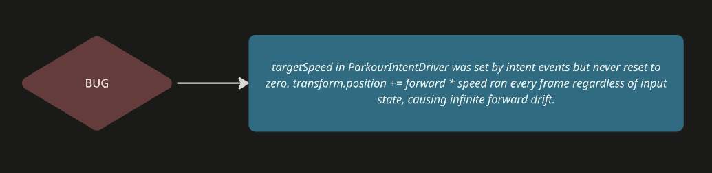
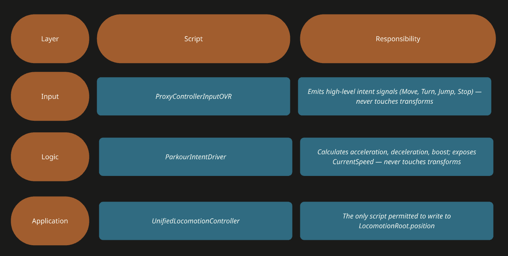
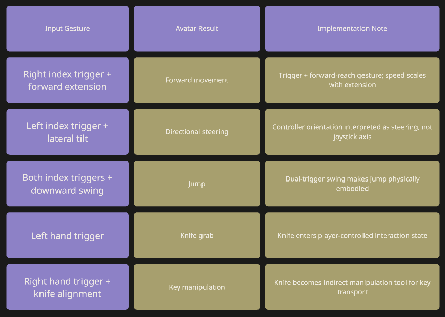

## Context and Starting Point

At the project's outset, movement was implemented through several scripts operating independently: ParkourIntentDriver, ProxyControllerInputOVR, and various pull/grab mechanics each directly modified the LocomotionRoot transform. This decentralized approach quickly produced compounded movement effects - the character drifted forward endlessly without any new input.

## Root Cause Analysis

Two structural issues were identified. First, ProxyControllerInputOVR emitted MovementIntent events whenever joystick thresholds were exceeded, but emitted no STOP intent when input returned to neutral. Stale intent values therefore persisted. Second, pull mechanics and directional locomotion were running in parallel with no coordination layer between them.

## Architectural Refactor
The solution was a three-layer architecture with strict ownership over transform writes:

UnifiedLocomotionController aggregates the controller's forward direction (when trigger is held), pull delta from controller position changes, and speed values from ParkourIntentDriver into a single movement vector computed once per frame.

## VR-Specific Concerns
Direct Y-axis hard resets and frame-by-frame transform overrides were removed from ParkourIntentDriver. In VR, physical head and controller offsets must remain natural - any script that clamps Y to a fixed value will produce a jarring snap whenever the player physically bends or crouches.

## Controller Input Design

The final gesture-based control scheme was defined as follows:

