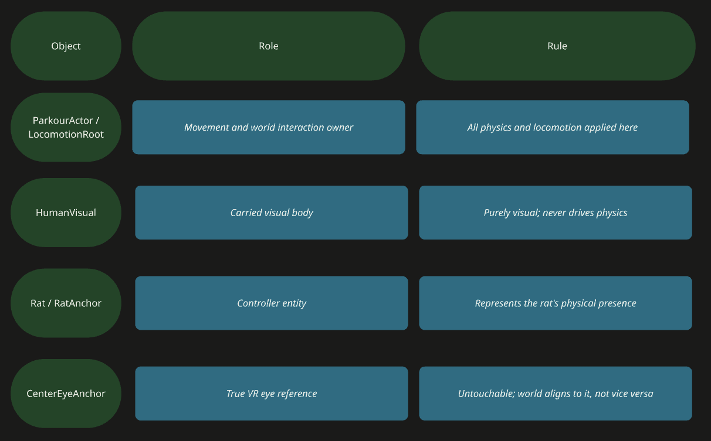

## The Core Concept

The project's central conceit is that the player is not the human character moving through the parkour environment — the player is the rat sitting on the human's head, steering by pulling hair. This required the camera to represent rat-eye perspective, not a generic first-person or third-person view. Getting this right became the most architecturally complex problem in the entire project.

## Human Model Integration Problems

A human-like model was imported from the Asset Store. It consistently failed to appear in-game despite being present in the hierarchy. Diagnosis involved checking: culling mask, layer assignment, scale, position, LOD Group settings, and prefab import constraints. The character appearing as an outline in the editor but invisible at runtime indicated an LOD or render-pipeline mismatch.

## OVR Rig Parenting Restrictions

The deeper structural problem was that OVRCameraRig and CenterEyeAnchor cannot be reparented like ordinary GameObjects. Attempts included:
•	Moving OVRCameraRig under LocomotionRoot or RatAnchor
•	Creating new anchors under TrackingSpace
•	Applying offset via RatRoot.TransformDirection
•	Copying RatRoot transform directly onto the camera

Each attempt produced one of three symptoms: a flying camera that drifted upward indefinitely, a camera locked to the ground, or continuous forward drift. The Unity error 'Cannot restructure Prefab instance' confirmed that CenterEyeAnchor resets itself at runtime and cannot be repositioned by standard parenting.

## Role Assignment in the Hierarchy

## Camera Architecture Decision

The final decision: CenterEyeAnchor is an immovable reference point. The world and all characters must be organized around it. The camera itself must never be physically moved as a gameplay object. Any attempt to make the camera 'follow' a game object in VR creates tracking conflicts with the headset's internal pose tracking.

The goal state — visible in the same frame: the human's hair, the rat's ears and hands, but the player never feeling like the human — defined all subsequent camera decisions. This is the project's central visual metaphor: the rat is the perceiving subject; the human is the steered object.

## Human Grounding Problem

The human model's feet did not touch the ground correctly — the character appeared partially sunken into the floor. Root cause: the ParkourActor capsule collider center and height did not match the visual mesh, and VR floor-level tracking differed from the visual body's reference height. The fix targeted Collider center Y, capsule height, and HumanVisual local Y offset simultaneously — never the camera.
