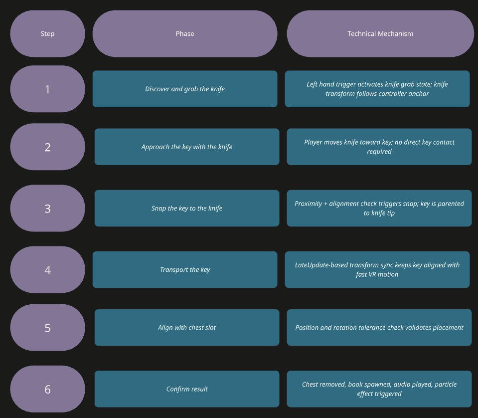
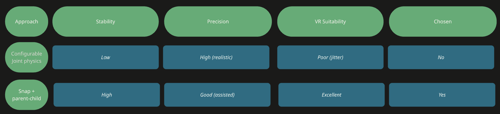

## Interaction Design Goal

The parkour environment includes an object interaction sequence: the player must use a knife as an indirect manipulation tool to transport a key to a chest slot, unlock the chest, and trigger a book reveal. This is described academically as tool-based indirect manipulation - the knife is the tool, the key is the indirectly controlled object, and snapping provides system-assisted precision.

<div class="video-block">
  <video controls playsinline class="demo-video">
    <source src="grab_knife.mp4" type="video/mp4">
  </video>
</div>

## Interaction Sequence



## Knife Grab - First Problems
The initial knife grab script used a button-based grab state and updated knife transform to match controller position and rotation. Two failure modes appeared:
•	The button field in the Unity Inspector was left as None - the script received no valid input and grab never activated
•	Controller side, button type (Axis1D vs Button), and object references all had to be verified independently

The initial grab-follow logic was structured as follows:

```csharp
if (OVRInput.GetDown(grabButton)) isGrabbed = true;
if (OVRInput.GetUp(grabButton)) isGrabbed = false;

if (isGrabbed && rightControllerAnchor != null)
{
    transform.position = rightControllerAnchor.TransformPoint(positionOffset);
    transform.rotation = rightControllerAnchor.rotation * Quaternion.Euler(rotationOffset);
}
```

A second issue emerged when multiple grab scripts were active on the same object simultaneously. Transform-follow logic and physics-based grab logic competed, producing erratic behavior. The fix: one and only one attachment strategy per object.

## Physics-Based Key Attachment - Attempt and Failure

The first key attachment approach used ConfigurableJoint with spring, damper, maximum distance, grab threshold, and release threshold parameters. The intended effect was a key hanging from the knife like a fish on a hook - physically reactive and visually convincing.

One version of the physics-based knife grab logic was implemented as follows:

```csharp
float gripValue = OVRInput.Get(OVRInput.Axis1D.SecondaryHandTrigger);

if (!isGrabbed && gripValue > 0.05f) ForceGrab();
if (isGrabbed && gripValue < releaseThreshold) ReleaseKnife();

joint = gameObject.AddComponent<ConfigurableJoint>();
joint.connectedBody = handRb;
joint.xMotion = joint.yMotion = joint.zMotion = ConfigurableJointMotion.Locked;
```

The corresponding key attachment script was tested in the following form:

```csharp
if (attached || knifeTipRb == null || knifeGrab == null) return;
if (!knifeGrab.IsKnifeGrabbed) return;

joint = gameObject.AddComponent<ConfigurableJoint>();
joint.connectedBody = knifeTipRb;
joint.linearLimit = new SoftJointLimit { limit = maxDistance };
joint.xMotion = joint.yMotion = joint.zMotion = ConfigurableJointMotion.Limited;
```

Problems with this approach:
•	Key pushed away from the knife instead of attaching - the system was in collision-response mode, not attachment mode
•	Multiple attachment scripts accidentally active at once caused undefined behavior
•	ConfigurableJoint + Rigidbody constraints + trigger timing created cascading instability
•	A compile error appeared: an external script attempted to read a grab state property that was not exposed as a public readable field from the knife component
•	Chest-area colliders triggered the placement check prematurely before the key reached the slot

## Snap-Based Solution
The key handling system was redesigned around snapping. When knife tip and key met proximity/alignment conditions, the key was parented to the knife tip. LateUpdate-based transform synchronization ensured the key visually kept up with fast VR controller motion without lag artifacts.

The snap-based solution was implemented with a dedicated follow script:

```csharp
if (other.transform != knifeTip || snapped) return;

rb.isKinematic = true;
rb.useGravity = false;
transform.SetParent(knifeTip);

localPosOffset = transform.localPosition;
localRotOffset = transform.localRotation;
```



## Chest Slot Validation

Trigger-based collision checks were replaced with position and rotation tolerance validation. The chest slot script compared the transported key's world position and rotation against target values within defined thresholds. Once validated:
•	Audio confirmation played
•	Chest was removed from the scene (SetActive false or Destroy)
•	Knife was optionally removed
•	A book was spawned at a dedicated empty-transform spawn point
•	Optional particle effect was triggered

The validation phase then checked whether the carried key matched the slot's target position and rotation within small tolerances, instead of relying on raw trigger overlap.

<div class="video-block">
  <video controls playsinline class="demo-video">
    <source src="open_chest.mp4" type="video/mp4">
  </video>
</div>

The book reveal stage used the following animation script:

```csharp
startPos = transform.position;
endPos = startPos + Vector3.up * riseHeight;

float smooth = 1f - Mathf.Pow(1f - p, 3f);
transform.position = Vector3.Lerp(startPos, endPos, smooth);
transform.localScale = Vector3.Lerp(Vector3.zero, Vector3.one, smooth);
```

A critical implementation note: the book spawn point must be a dedicated empty Transform - using any other object reference (such as the chest itself) caused the spawn to fail after the chest was removed.
