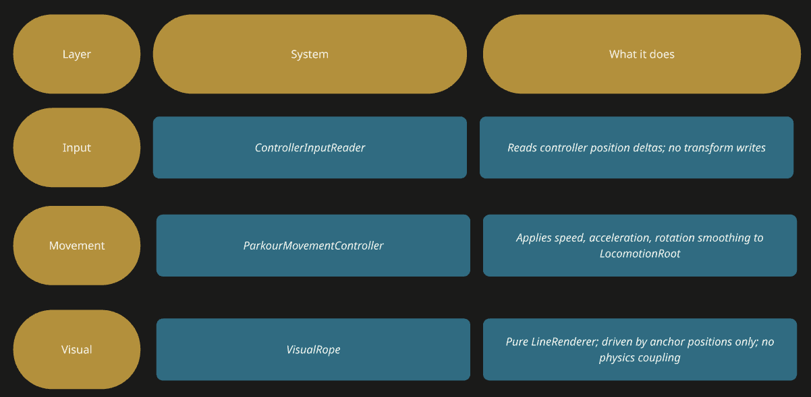
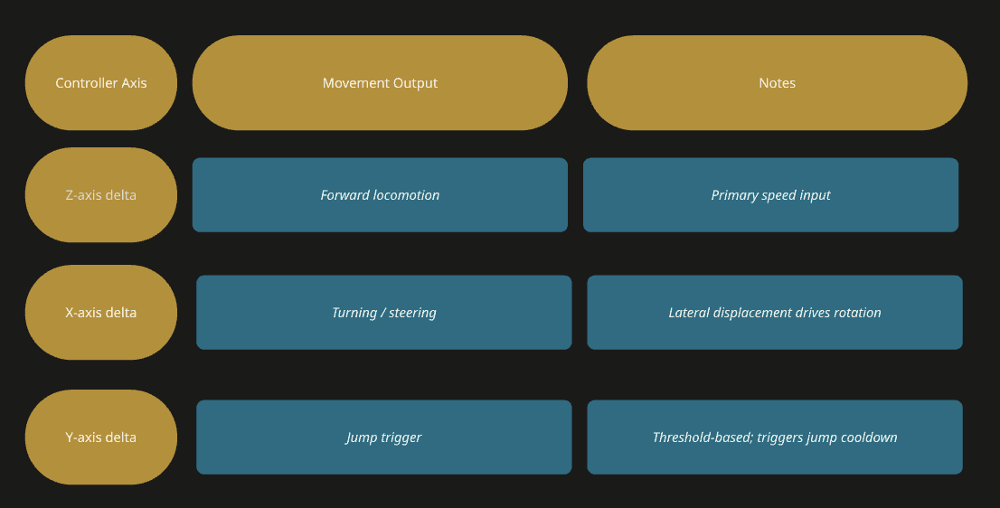

---
title: "Rope Visual & Gesture-Based Control"
weight: 6
resources:
  - src: dev_page_6.jpg
    params:
      cover: true
---

## Original Design Intent

The locomotion metaphor - rat pulling human hair via reins - required a visible rope connecting the rat's hands to the human's hair. The first implementation attempted to use a LineRenderer-based rope as both a visual element and a logical control element: rope tension and direction would drive movement.

## First Implementation: Physics-Based Rope

Anchors HairGrab_L/R were placed on the human hierarchy. RatHand_L_Follow anchors represented the rat's hand positions. A cylinder-based mesh rope connected them. Problems appeared immediately:
•	Transform-space conflicts: world-space versus local-space inconsistencies caused the rope to appear below the ground plane
•	Texture tiling artifacts made the rope appear dotted at certain lengths
•	Back-face culling caused the rope to disappear when viewed from certain angles
•	Unity's Y-axis default elongation for cylinder primitives required manual rotation correction
•	Animator-driven bone interference: parent bones moved by the animator shifted the rope anchors unpredictably

## Architectural Correction: Decouple Visual from Logic

The key insight was that rope physics and locomotion logic had been conflated. The rope's length, direction, and tension were never reliable locomotion signals - they were too unstable for control purposes. The correction:

VisualRope was relocated under LocomotionRoot to prevent world transform distortion caused by animated parents. Anchors (HeadAnchor, RatHandAnchor_L/R) serve as spatial markers only - they carry no control logic.

## Controller Delta System

ControllerInputReader introduced calibration-based delta tracking: the controller's initial local position is stored as a reference at grab time. Per-frame deltas are measured relative to this origin. A dead-zone filter suppresses noise-based micro-movements. Axis mapping:

## Hair Grab Anchor Placement

Because the human's head bone is not directly accessible as a named transform, HairGrab_L and HairGrab_R were placed under the character's upper-body root (npc_hmn_01m_parts). On the rat side, since no explicit hand bones were available, RatHand_L and RatHand_R empty GameObjects were added under the rat body root. These became the logical endpoints for the visual rope - representing the mechanical causality: the rat is pulling something, and the human follows.

## Build Failure: IL2CPP / Meta XR Conflict

Android builds failed with an IL2CPP compilation error referencing Meta.XR.ImmersiveDebugger.Utils.ValueStruct. Initial suspicion pointed to user-authored scripts. Investigation revealed the Meta XR Immersive Debugger package was incompatible with Unity 6 under IL2CPP. Disabling the Immersive Debugger package resolved the build failure entirely - no changes to custom scripts were required.

## Movement Smoothing

To prevent robotic motion, Mathf.MoveTowards was applied to speed transitions. Jump cooldown mechanisms prevented double-jumps. Rotational smoothing used Slerp/LookRotation to prevent the spin artifact that appeared when angular velocity was applied as an absolute per-frame value - earlier pull implementations that used SignedAngle directly caused the human to spin uncontrollably.

