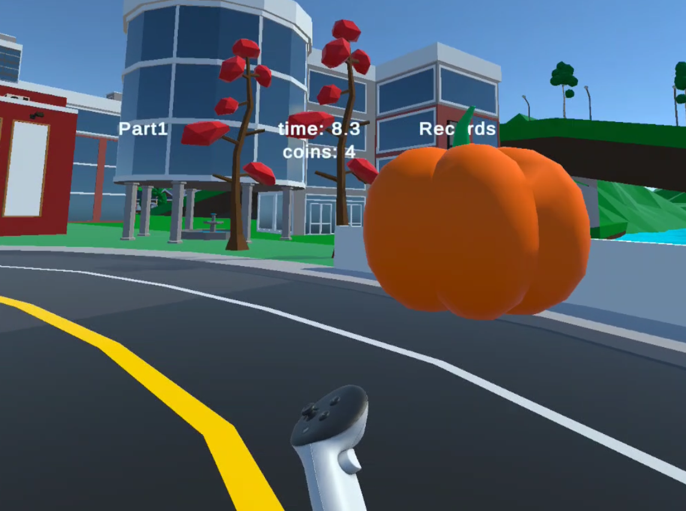
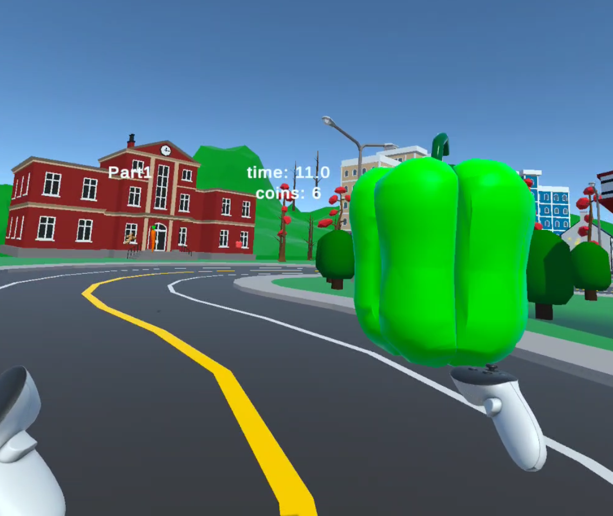

## Scene Activation Flow

Rather than revealing all objects when the scene loads, the project implemented a deliberate reveal: only the start object is visible at scene start. When the player enters the designated start zone and presses X, all gameplay objects activate progressively. This creates a clean runtime entry point and prevents the player from being overwhelmed by the environment before they have oriented themselves.

## Start Flow Problems

Three categories of failure appeared during implementation:
•	Initialization order: objects revealed themselves immediately because SetActive was called before the BoxActivator had a chance to suppress them
•	Extra components on activated objects interfered with active-state management — debug scripts silently re-enabled objects that the activation system had intentionally hidden
•	Outdated UI button references: the start button logic was wired to a legacy UI button instead of the VR controller X input

VR-safe player detection was also required. The activation zone could not rely on a standard CharacterController trigger — the OVR player rig enters trigger zones differently.

## Collectible System: From Coins to Vegetables

The project's collectibles replaced generic coins with vegetable-themed objects to reinforce the environment's culinary identity (consistent with the Ratatouille concept). The first attempt simply placed a vegetable model inside the coin prefab — this caused every collectible to show the same vegetable, since all instances of a prefab share the same asset data.

The correct solution preserved the coin collection logic entirely and changed only the visual layer:
•	Coin behavior scripts remained unchanged
•	An IngredientType enum was introduced
•	Vegetable prefabs were stored in an array
•	Each pickup instance at startup randomly selected and instantiated one vegetable from the array

Audio feedback was paired with collection events to provide sensory reinforcement — a small but significant contribution to the gameplay rhythm between fast traversal segments and slower interaction segments.

## Rat Secondary Animation

The rat model required secondary motion to feel alive rather than static. A RatSecondaryMotion script generated:
•	Sin-based oscillation for ears and tail
•	Gentle body tilt based on movement direction
•	Breathing / idle micro-motion for the torso

A critical issue: the Animator was resetting root/body bone poses every frame, and the secondary motion script was overwriting localRotation directly — causing the two systems to fight. The fix required three rules:
•	Base pose must be captured in Start/Awake and stored
•	Additive offsets must be applied on top of the Animator's pose, not instead of it
•	Never write quaternion values from scratch — always compose from the stored base pose

## Hardware Debugging Note

During VR controller input debugging, what appeared to be a software input chain failure — prompting inspection of OVRManager, OVRHands, deprecated components, and Active Input Handling settings — was ultimately caused by depleted controller batteries. This triggered a cascade of software investigations before the hardware cause was identified. The lesson applies broadly to VR development: always verify hardware and runtime state before debugging script logic.

