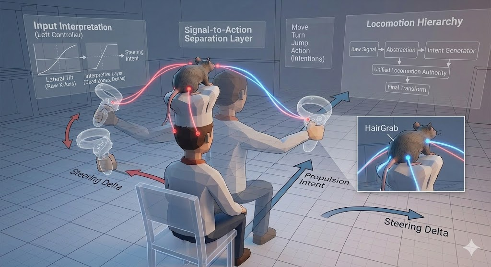
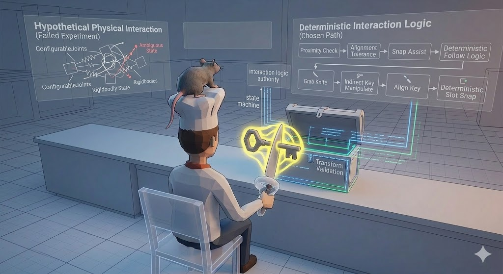

### Rethinking locomotion as embodied control

One of the most demanding parts of the project was building a locomotion system that did not rely on conventional joystick movement, but instead used controller-based gestures and trigger input as the primary driver of motion. This immediately made the problem more complex than a standard VR locomotion setup. Forward motion, steering, and jump-like actions were not mapped to a single analog stick. Instead, they had to emerge from combinations of controller states, spatial movement, and timing. In practice, this meant interpreting the left controller index trigger together with lateral tilt for steering, the right controller index trigger together with forward extension for propulsion, and both triggers with a downward swing motion for jump-related behavior.

The real difficulty was not just defining those mappings, but making them stable enough to feel intentional. In VR, controller input is inherently noisy: hands drift, players make small unconscious movements, and sensor readings are rarely as clean as a flat 2D input source. A gesture-based locomotion model can therefore feel arbitrary unless the system clearly distinguishes between meaningful motion and incidental hand movement. This forced the project beyond basic button reading and into more careful signal interpretation. Dead zones, controller deltas, reference poses, and trigger thresholds became essential. It also became necessary to understand the hardware input model correctly. Index triggers, for example, could not always be treated like simple pressed-or-not-pressed buttons; in several cases they had to be read as analog Axis1D values, which directly changed how movement activation was detected and debugged.

At the same time, the issue was architectural, not only input-related. Several parts of the system were initially capable of influencing movement at once. Intent-producing scripts, controller readers, and movement application logic all had overlapping responsibilities, which made locomotion behavior unstable. The same scene object could appear to receive movement from multiple sources, causing drift, stale movement states, or actions that continued after the originating gesture had already ended. The turning point came when the locomotion system was reorganized around a single final authority. Once input abstraction, movement intent generation, and final transform application were treated as separate layers, locomotion became much easier to reason about and extend.

What made this challenge especially important was that locomotion was not merely a utility layer. It was one of the project’s core design statements. Solving it required treating controller signals not as raw commands, but as embodied motion cues that needed interpretation, filtering, and architectural discipline. The main lesson was that unconventional VR movement does not fail because the idea is too ambitious; it fails when input meaning, motion ownership, and final application are not separated clearly enough.

A second major challenge was making the project’s control metaphor perceptually understandable. The experience was not supposed to function like a normal first-person VR controller, nor like a detached third-person game. The player was not simply “inside” the human character, but also not controlling an abstract floating camera. Instead, the design aimed to place the player within a mediated control relationship in which a rat-centered perspective and influence structure shaped the movement of a visible human body. Translating that idea into a stable Unity scene hierarchy and a convincing VR viewpoint turned out to be one of the most difficult parts of the project.

The technical challenge began with role separation. The visible human mesh, the locomotion root, and the active camera reference could not all be treated as the same object. If they were linked too directly through parent-child chains, the result quickly became unstable: tilt propagated incorrectly, the camera appeared to float or fly, and even small rotation changes could make the player feel disconnected from the body being represented. This was especially sensitive in VR, where the OVRCameraRig and anchors such as CenterEyeAnchor impose practical constraints. A hierarchy that looks reasonable in a static scene can behave very differently once head-tracked motion, runtime rotation, and body-follow logic begin interacting.

This is where proxy design became essential. The project needed a visible and believable distinction between the carried human body and the controlling influence behind it. HumanVisual, locomotion roots, shoulder silhouette, HairGrab references, and RatHand anchor points gradually evolved into a more deliberate hierarchy that gave each object a clear role. The key insight was that spatial hierarchy in VR is not only an organizational issue, but part of the user experience itself. A poorly structured hierarchy does not merely create technical problems; it changes how the player interprets embodiment, agency, and presence.

Another layer of this challenge involved visual causality. Hair-link structures and rope-like visual connectors were explored as a way to make the relation between the rat and the human more legible. These elements helped communicate where influence came from and how it was transferred. At the same time, an equally important insight emerged: this visual layer should not remain the main owner of movement logic. If the rope or hair link also became the primary locomotion driver, representation and authority became entangled, making both debugging and design clarity harder. The eventual direction was to keep visual links as explanatory structures while locomotion authority remained elsewhere.

The broader lesson here was that in VR, camera placement, hierarchy design, and control metaphor cannot be solved independently. They shape each other continuously. The project only became coherent when the visible body, the control source, and the camera’s perceptual role were all given distinct but coordinated responsibilities. In that sense, this challenge was not only about technical stability; it was about making the project’s central idea readable to the player.

### Choosing reliability over raw physical complexity

The third major challenge emerged when the project moved from locomotion into object interaction. The goal was not to let the player directly pick up a key and place it in a lock using a standard VR grab interaction. Instead, the interaction model extended the project’s broader design language of indirect control: the player first grabbed a knife, then used that knife as the active tool, and only through that tool manipulated the key before aligning it with the chest slot. This made the interaction system much more distinctive, but also much harder to stabilize.

At first, it was tempting to approach the key behavior through a more physically expressive system. Ideas similar to ConfigurableJoint-based attachment, spring-like follow behavior, and semi-physical hanging or trailing motion were explored to make the key feel reactive rather than rigid. On paper, this made sense. If the interaction was indirect, adding more physicality seemed like a natural way to increase immersion. In practice, however, VR object interaction is highly sensitive to ambiguity. When multiple attachment scripts, rigidbody constraints, collision events, and trigger timings all influence the same object, the interaction can quickly stop feeling intentional. An object may appear to be attached when it is actually only colliding, or it may respond physically without producing a readable gameplay state.

That trade-off became one of the core engineering questions of the interaction system. The project had to decide whether physical richness mattered more than reliable player-facing behavior. Over time, the answer became clear: for this project, readable control and deterministic progression mattered more than maximum physical simulation. This led to a snap-assisted design in which the key attached to the knife under explicit proximity and alignment conditions, then followed it through a more controlled transform-based logic. That shift was important because it marked a move away from “the system should behave physically” toward “the system should communicate interaction state clearly.”

The same principle continued at the chest stage. Instead of depending on unstable trigger-heavy physical validation, chest resolution became more reliable through transform-based checks using position and rotation tolerances. Once the key reached the correct alignment, the rest of the sequence could happen as a clean state transition: chest resolution, optional knife cleanup, book spawning, and feedback presentation. In other words, the puzzle stopped being a fragile bundle of physics reactions and became an interaction pipeline with explicit state logic.

What makes this challenge especially meaningful is that it reflects a broader truth about VR development: realism and reliability are not always aligned. A more physically complex interaction is not necessarily a better interaction if the player cannot clearly read what the system is doing. The final lesson was that successful VR interaction often depends less on simulating everything and more on choosing where to simplify, where to snap, and where to turn ambiguity into explicit state transitions.

